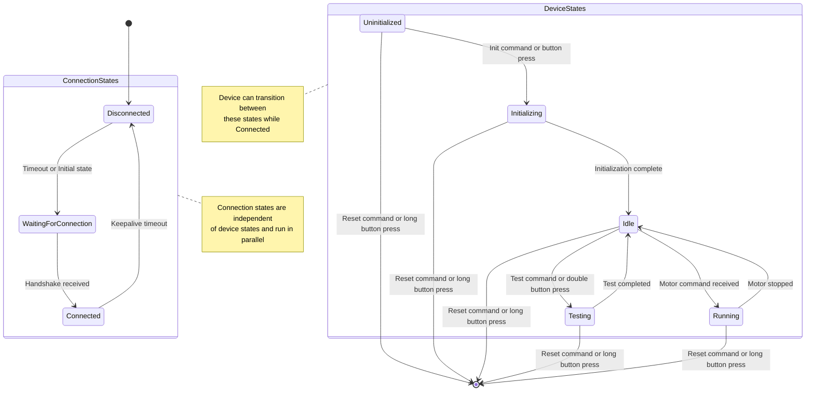

```mermaid
stateDiagram-v2
    [*] --> Disconnected
    
    state ConnectionStates {
        Disconnected --> WaitingForConnection : Timeout or Initial state
        WaitingForConnection --> Connected : Handshake received
        Connected --> Disconnected : Keepalive timeout
    }

    state DeviceStates {
        Uninitialized --> Initializing : Init command or button press
        Initializing --> Idle : Initialization complete
        Idle --> Testing : Test command or double button press
        Testing --> Idle : Test completed
        Idle --> Running : Motor command received
        Running --> Idle : Motor stopped
    }

    Uninitialized --> [*] : Reset command or long button press
    Initializing --> [*] : Reset command or long button press
    Idle --> [*] : Reset command or long button press
    Testing --> [*] : Reset command or long button press
    Running --> [*] : Reset command or long button press

    note right of ConnectionStates
        Connection states are independent
        of device states and run in parallel
    end note

    note right of DeviceStates
        Device can transition between
        these states while Connected
    end note

```